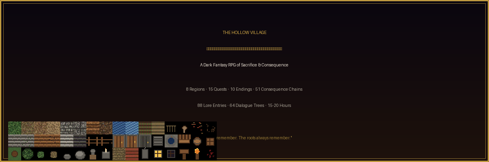
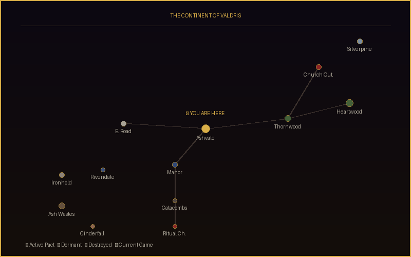
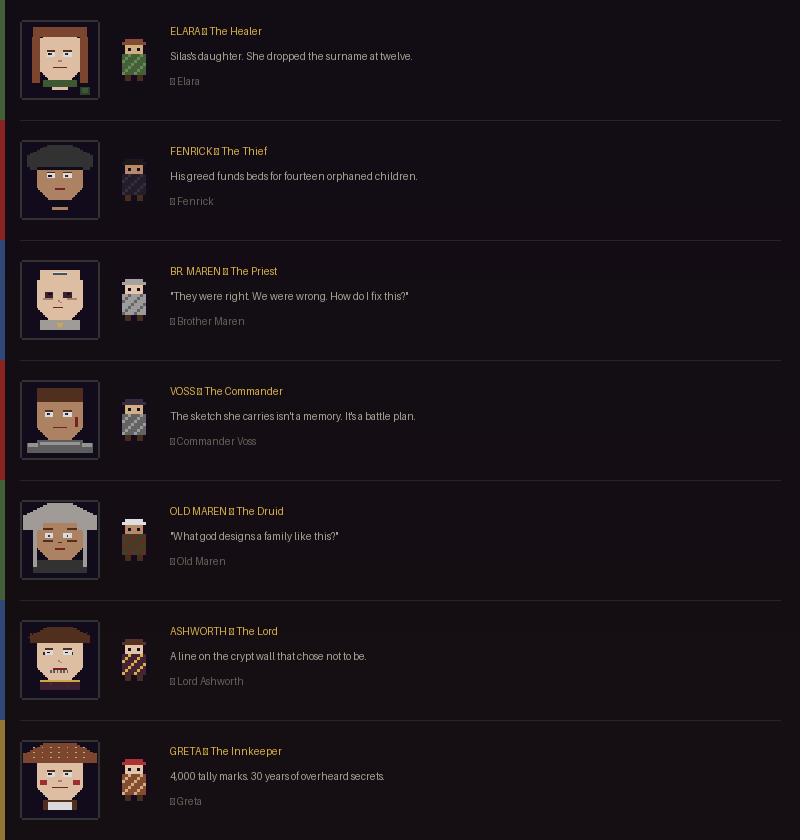
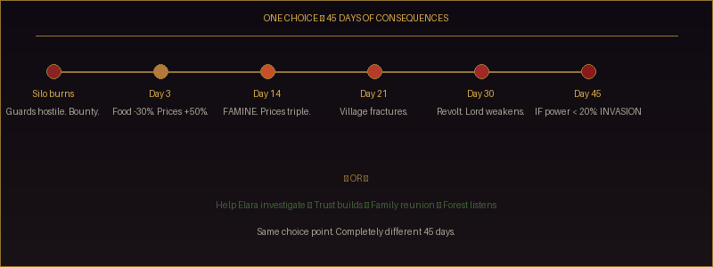
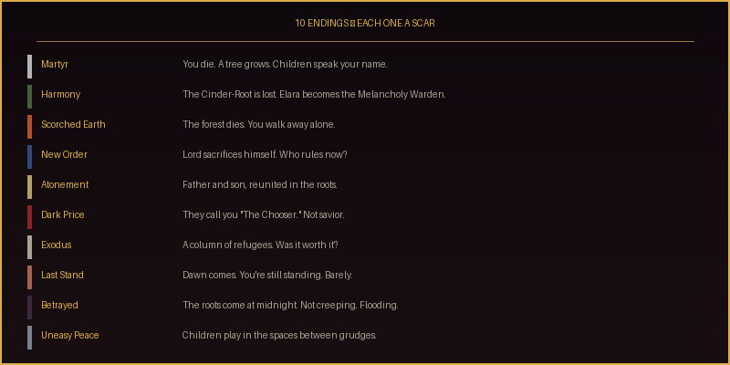
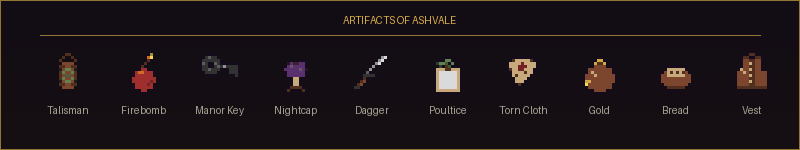
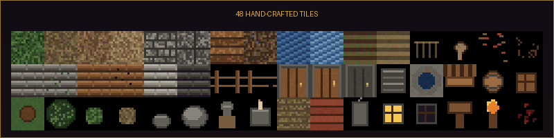

<div align="center">

<br>



<br>


<br>

> *"The forest does not enjoy what we give it. It grieves every time.*
> *Let me show it that at least one of us can walk in with open hands."*
>
> — **Wren, the only willing sacrifice in 300 years**

<br>

---

</div>

## The Premise

Every thirty years, the lord of Ashvale feeds a human soul to the forest. In return, the crops grow. The wells run sweet. The plagues stay away.

**This year, the lord refused.**

Now the crops are dying. The water tastes of poison. A priest preaches divine punishment while a thieves' guild plots in the shadows. An army gathers on the horizon. And deep in the Thornwood, something ancient is losing patience.

*You arrive carrying a dead man's compass. It hasn't pointed north in thirty years.*

---

<div align="center">

## ─── The World ───

</div>



<table>
<tr>
<td width="50%">

### Ashvale Village
A once-prosperous farming village. The bread tastes like chalk. The well water has a metallic aftertaste that Elara says smells like "bitter almonds and broken promises." The blacksmith's dog still waits at an empty forge.

</td>
<td width="50%">

### Thornwood Forest
Ten thousand years old. A vast consciousness dreaming in the root network. It remembers every soul given to it. They're not dead — they're *dreaming* inside the roots. And the forest is running out of patience.

</td>
</tr>
<tr>
<td>

### Ashworth Manor & Catacombs
The lord paces fourteen steps. Desk to window. Below: catacombs with 300 years of ghost letters, scratch marks from nine sacrifices, and a ritual chamber where the altar still pulses with a heartbeat that isn't yours.

</td>
<td>

### Eastern Road & Beyond
Ironmarch scouts. Broken merchant carts. Boot prints from twenty soldiers. And beyond — the continent of Valdris, where 16 more pacts wait to be broken, honored, or betrayed.

</td>
</tr>
</table>

---

<div align="center">

## ─── The People Who Carry This Weight ───

</div>

> *Every NPC has a schedule, a memory system, a multi-dimensional relationship (trust / affection / respect / fear / debt), and a past that connects to every other character through blood, grief, or silence.*



<details>
<summary><b>The Maren Family Triangle — the emotional spine of the story</b></summary>
<br>

**Old Maren** (grandmother) → lost her son **Silas** to the forest sacrifice 30 years ago

**Silas** had two children: **Elara** (the herbalist) and **Brother Maren** (the priest)

They are **siblings** — neither knows. Old Maren recognized her grandson the day he arrived and **said nothing**. The priest has been poisoning the village where his sister lives.

*"I lost my son to the forest. I lost my grandson to the Church. And now the grandson is poisoning the village where the granddaughter lives. Tell me — what god designs a family like this?"*

</details>

---

<div align="center">

## ─── The Weight of Choice ───

</div>

> *There are no good choices in Ashvale. Only less terrible ones.*



A single decision cascades through **six interconnected systems** over weeks of in-game time. The player who burned the silo and the player who helped Elara investigate experience completely different worlds — different NPC dialogue, different economy, different faction power, different visual environment, different endings.

**51 consequence chains. 500+ flags. No two playthroughs are the same.**

---

<div align="center">

## ─── 10 Endings, Each One a Scar ───

</div>



Every ending plants a **sequel hook**. The Heartwood's distress call is propagating through the continental root network. After 3,000 years, the consciousnesses are reaching a verdict on humanity. **What they decide depends on what happened in Ashvale.**

---

<div align="center">

## ─── Artifacts & Items ───

</div>



- **The Compass** — Made from a dead wife's wedding ring, carpentry nails, and chapel glass. Inscription: *"For E — find the sunlight. For M — find the warmth."*
- **Ghost Letters** — Five goodbyes spanning 300 years, found in the manor catacombs
- **The Talisman** — Shows what the forest wants you to see. Not always what you want to see.

---

<div align="center">

## ─── Lore That Lives in the Details ───

</div>

> *88 codex entries. 144 progressive fragments. 40 village memories. 5 ghost letters. 30 micro-lore entries. This isn't a world described in exposition dumps — it's a world you discover in margins, scratches, and whispers.*

<table>
<tr>
<td width="50%" valign="top">

**Objects That Tell Stories**
- A half-finished chair in an abandoned workshop. It was for Elara. She was four.
- An inn beam carved: "H + S — FISHING FOREVER"
- A knife with no blade. The lord's men took the blade when they came for Fenrick's grandmother.
- The chapel bell hasn't rung since the priest arrived — it resonates at a frequency the forest can hear.

</td>
<td width="50%" valign="top">

**The World Whispers**
- Dead songbirds near the well with black beaks, still staring at the sky
- A river downstream spells words every night: COME. BACK. PLEASE.
- The Ash Wastes sand whispers — dead roots can't grow but can remember fire
- Harlan's unsent letter, rewritten every spring for 30 years: *"I should have been your friend when it mattered."*

</td>
</tr>
</table>

---

<div align="center">

## ─── The Tileset ───

</div>



48 hand-crafted tiles with 3-tone shading, dithered textures, and distinct visual language. Cobblestone reads as cobblestone. Dead farmland reads as dead farmland. Every tile tells a story about what this place used to be.

---

<div align="center">

## ─── Architecture ───

</div>

Built on **10 interconnected autoload singletons** communicating through a signal-driven event bus.

```
 Player Action
      │
      ├──→ GameState.set_state("flag.X", true)
      │         │
      │         ├──→ QuestManager     ──→  FSM transitions  ──→  consequence chains
      │         ├──→ WorldSimulation  ──→  ecology/economy   ──→  visual tile changes
      │         ├──→ NarrativeEngine  ──→  atom evaluation   ──→  world events fire
      │         ├──→ FactionManager   ──→  reputation ripple ──→  NPC behavior shifts
      │         ├──→ RelationshipMgr  ──→  5-axis update     ──→  dialogue gating
      │         └──→ TimeManager      ──→  scheduled events  ──→  delayed consequences
      │
      └──→ 51 consequence chains with delayed/conditional effects over days
```

<details>
<summary><b>System Details</b></summary>

| System | Purpose | Scale |
|:-------|:--------|:------|
| **GameState** | Centralized blackboard — every system reads/writes here | 500+ flags |
| **NarrativeEngine** | JSON dialogue trees with conditions, triggers, slot-filling | 64 trees, 1000+ nodes |
| **QuestManager** | FSM-based quests with silent background updates | 15 quests, 113 variants |
| **WorldSimulation** | Ecology, economy, rumor propagation | Daily ticks |
| **ConsequenceChains** | Immediate + delayed + conditional cascading effects | 51 chains |
| **RelationshipManager** | Trust, affection, respect, fear, debt per NPC | 5 dimensions |
| **FactionManager** | 2D matrix with ripple effects | 6 factions |
| **TimeManager** | Clock + cron-job events + day/night | Minute-level |
| **SaveManager** | Full state serialization — multiple slots | Complete state |
| **AudioManager** | Mood-reactive music, ambient layering | 21 audio files |

</details>

---

<div align="center">

## ─── Narrative Design Influences ───

</div>

<table>
<tr>
<td align="center" width="25%">
<b>The Witcher 3</b><br><br>
<sub>Forked consequences across separate quests. One choice sets 4 flags that activate independently across 3 quest chains. No binary good/evil — only less terrible options.</sub>
</td>
<td align="center" width="25%">
<b>Baldur's Gate 3</b><br><br>
<sub>NPC interjections during dialogue. Silent approval tracking. Involuntary consequences from accumulated flag patterns — the Dark Urge pattern adapted for a village mystery.</sub>
</td>
<td align="center" width="25%">
<b>Red Dead Redemption 2</b><br><br>
<sub>Ambient overhear system. Honor-gated dialogue variants. Internal monologue journal. The weight of mundane moments — a chair never finished, a letter never sent.</sub>
</td>
<td align="center" width="25%">
<b>God of War Ragnarök</b><br><br>
<sub>Prophecy subversion through accumulated behavior. Family conflict woven into every mechanic. The grandmother, the grandson, and thirty years of silence between them.</sub>
</td>
</tr>
</table>

---

<div align="center">

## ─── The Continent of Valdris ───

*Ashvale is Pact #14 of 17. Sixteen remain unresolved.*

</div>

```
        ┌─────────────────────────────────────────────────────────┐
        │                    VALDRIS CONTINENT                     │
        │                                                          │
        │   ◆ Silverpine (#15)           ◇ Breathing Marshes (#16) │
        │     Mountain — THRIVING          UNKNOWN                  │
        │     Church crusade incoming                               │
        │                                                          │
        │          ◆ Druid Conclave (hidden)                       │
        │                     ◆ Hollowreach (Guild HQ)             │
        │   ◇◇◇ Eastern                                            │
        │   Frontier         ★ ASHVALE (#14)                       │
        │   (#8-10)            ← YOU ARE HERE                      │
        │   Under Church                                            │
        │   attack           ◆ Rivendale (#11)                     │
        │                      River pact — DORMANT                │
        │   ▓▓▓▓▓▓▓▓▓▓        The river calls for Voss            │
        │   ASH WASTES                                              │
        │   (#1-7)           ◆ Ironhold (Legion Capital)           │
        │   7 DESTROYED        Built on dead roots                 │
        │   PACTS                                                   │
        │                    ◆ Cinderfall (Church HQ)              │
        └─────────────────────────────────────────────────────────┘
```

<details>
<summary><b>Sequel Hooks</b></summary>

- **Harmony ending** → Silverpine calls: *"The Church is coming. Send the bridge-walker."*
- **Exodus ending** → Voss: *"Rivendale. I have unfinished business."*
- **Martyr ending** → Thousands of dreaming sacrifices, singing the same song across the continent
- **All endings** → The deep root network reaches a verdict on humanity after 3,000 years of debate. What they decide depends on what happened in Ashvale.

</details>

---

<div align="center">

## ─── Installation & Setup ───

</div>

### Prerequisites

- [**Godot Engine 4.6+**](https://godotengine.org/download) (standard version, not .NET)
- **Git** for cloning the repository
- **~200 MB** disk space

### Install & Run

```bash
# 1. Clone the repository
git clone https://github.com/shankha06/village_simulation.git
cd village_simulation

# 2. Option A — Run the game directly
godot --path .

# 2. Option B — Open in the Godot editor, then press F5
godot --path . --editor
```

> **Note:** On Linux, the Godot binary may be named `godot4` or require the full path. You can also download it directly from [godotengine.org/download](https://godotengine.org/download) and run:
> ```bash
> /path/to/Godot_v4.6.2-stable_linux.x86_64 --path .
> ```

---

<div align="center">

## ─── How to Play ───

</div>

### Controls

| Key | Action | | Key | Action |
|:---:|:-------|---|:---:|:-------|
| `W A S D` | Move (8 directions) | | `I` | Open Inventory |
| `E` | Interact / Talk | | `J` | Open Journal |
| `Space` | Dodge Roll (i-frames) | | `Q` | Quest Log |
| `Left Click` | Attack (melee) | | `L` | Lore / Codex |
| `H` | Help Overlay | | `M` | Map |
| `Esc` | Close Menus / Pause | | `Tab` | Cycle Journal Tabs |

### Your First 10 Minutes

1. **Watch the prologue** — A cinematic text crawl sets the stage. Press any key to skip if replaying.

2. **Talk to Harlan at the gate** — He's the first NPC you'll meet. He warns about the water and the forest. If you have the compass (you do — it starts in your inventory), show it to him. His reaction reveals the first thread of a 30-year mystery.

3. **Read the Notice Board** — Near the gate. It lists the village's problems and updates as the world changes.

4. **Visit Greta at the inn** — She's the village gossip hub. Buy a drink, ask questions. She knows something about everyone — for a price.

5. **Find Elara near the herb garden** — She's investigating the dying crops. Help her, and the main mystery begins. Refuse, and the story takes a different path.

6. **Explore everything** — Examine objects (dead birds at the well, old graves, the silo). Read signs. Search barrels. The world is dense with interactive elements — look for the floating **E** prompt.

### Tips for New Players

<table>
<tr>
<td width="50%" valign="top">

**Exploration**
- 🔍 **Examine everything.** Graves, wells, barrels, signs — every object has text that changes based on what you've discovered.
- 🌙 **Explore at different times.** Some events only happen at night. Some objects reveal secrets at dawn. The chapel cellar is accessible after midnight.
- 🗺️ **Check your Quest Log (Q)** for current objectives. The Lore tab (L) tracks discovered mysteries with [???] placeholders that fill in as you learn more.
- 🧭 **The compass reacts** to nearby secrets. Watch for notifications about it trembling or pointing.

</td>
<td width="50%" valign="top">

**Conversation**
- 💬 **Talk to everyone twice.** NPCs remember what you said. Return visits unlock new dialogue — they'll never repeat the same conversation.
- 👀 **Watch for conditional options.** Some dialogue choices only appear if you've discovered specific things. Showing evidence to NPCs changes conversations dramatically.
- 🤫 **Silence is a choice.** Sometimes saying nothing reveals more than asking. Watch NPC reactions.
- ⚖️ **There are no "right" answers.** Every choice closes some doors and opens others.

</td>
</tr>
<tr>
<td valign="top">

**Combat & Survival**
- ⚔️ **Combat is dangerous, not a grind.** Low HP pool. Every fight has a narrative reason. You can often avoid combat through dialogue.
- 🏃 **Dodge roll (Space)** grants brief invincibility frames. Use it.
- 🕊️ **Spare defeated enemies** for future consequences. Killing has ripple effects — nearby NPCs witness and remember.
- 🧪 **Craft items** once NPCs teach you recipes. Elara teaches alchemy. Old Maren teaches druidfire.

</td>
<td valign="top">

**The World Changes**
- 📅 **Time passes.** The world changes whether you're watching or not. Consequence chains fire over days and weeks. Check back on areas you've visited.
- 🌾 **Your choices are visible.** Burned buildings stay burned. Dead farmland spreads. Roots creep closer. The tilemap physically changes based on your decisions.
- ⏰ **Deadlines are real.** Some events have timed triggers. The Ironmarch ultimatum. The new moon. Ignore them at Ashvale's peril.
- 💀 **NPCs can die.** Permanently. And their death changes every quest they were connected to.

</td>
</tr>
</table>

### Walkthrough Hints (Spoiler-Free)

<details>
<summary><b>Act 1 — The Poison Mystery</b> (click to expand)</summary>
<br>

- The key question: **Who is poisoning the water?** There are 3 suspects and 10 clues scattered across dialogue and interactable objects.
- Talk to **Elara** first — she has the scientific evidence.
- Talk to **Greta** — she overhears everything. Pay for information.
- Talk to **Brother Maren** — watch his face when you mention nightcap root.
- Talk to **Old Maren** — she'll give you the talisman if you earn her trust.
- Visit the **well** with the investigation quest active — you can collect evidence.
- The **Church Outpost** in Thornwood has definitive proof — but you need to discover its existence first.
- **Don't accuse too early.** Wrong accusations have severe consequences.

</details>

<details>
<summary><b>Act 2 — The Gathering Storm</b></summary>
<br>

- A rider arrives with news of the **Ironmarch Legion**. The clock starts ticking.
- You need allies. Visit **Commander Voss** — prove yourself through evidence or combat.
- Unite the factions: Guild, Guard, Church, Druids, Mercenaries. Each requires different approaches.
- The **Eastern Road** is where the Legion confrontation happens.
- **Fenrick** has a side mission that changes your understanding of the Guild entirely.

</details>

<details>
<summary><b>Act 3 — Into the Thornwood</b></summary>
<br>

- You need the **Druid Talisman** from Old Maren to access the Heartwood Clearing.
- The **Warden** tests you before granting passage. Three trials. Failure means combat.
- At the Heartwood: **three paths.** Sacrifice, Severance, or Renegotiation. Each costs something irreplaceable.
- Bring allies. Who you bring changes the encounter.
- The **Ritual Chamber** beneath the manor offers a darker path — if you found the crypt key.

</details>

<details>
<summary><b>Maximizing Replayability</b></summary>
<br>

- **Play once blind.** Don't optimize. Let the consequences happen.
- **Second playthrough:** Try the opposite approach — burn what you saved, save what you burned.
- **Third playthrough:** Focus on the family mystery — show the compass to everyone, find all ghost letters.
- **Fourth playthrough:** Speed run the main quest to see how different the world looks with minimal intervention.
- There are **10 endings** and **113 quest resolution variants.** No two runs need to be the same.
- Hidden secrets only trigger at specific times of day or with specific items. Explore at midnight. Explore at dawn. The world rewards attention.

</details>

---

<div align="center">

## ─── Project Structure ───

</div>

<details>
<summary><b>Click to expand full project layout</b></summary>

```
village_simulation/
├── autoloads/           # 10 singleton systems
├── scenes/
│   ├── main/            # Root scene, game flow
│   ├── player/          # Movement, stats, combat
│   ├── npcs/            # NPC AI, memory, schedules
│   ├── ui/              # Dialogue, journal, inventory, codex
│   ├── world/           # 8 regions, interactables, transitions
│   ├── combat/          # Enemy AI, damage, surrender
│   ├── effects/         # Day/night, weather, visual changes
│   └── intro/           # Cinematic prologue
├── data/
│   ├── dialogues/       # 64+ branching dialogue trees
│   ├── quests/          # 15 FSM quest definitions
│   ├── narrative/       # 51+ consequence chains, atoms, clues
│   ├── lore/            # 88 codex + 40 memories + ghost letters + world history
│   ├── world/           # Tilemaps, interactables, ecology, economy
│   └── items/           # 21 items + 5 recipes
├── assets/              # Pixel art, audio, UI
├── docs/images/         # Promotional images for README
└── tools/               # Python generators for art, audio, tilemaps
```

</details>

---

<div align="center">

<br>

> *"We are not the main characters. We are the first chapter.*
> *What happens after us — that is the story."*
>
> — **Old Maren, the last druid of the Thornwood Circle**

<br>

*Built with [Godot Engine 4.6](https://godotengine.org) · Narrative design by [Claude](https://claude.ai)*

**© 2026 — The Hollow Collective**

*The roots remember. The roots always remember.*

<br>

</div>
